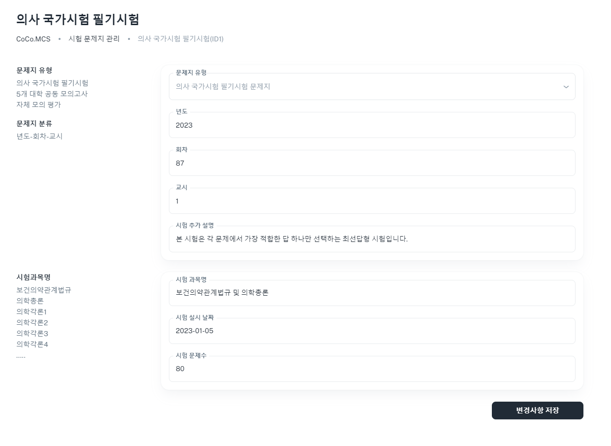

[돌아가기](../main.md)

 
 

# 2. 문제지 목록 편집하기

## 2-1. 편집할 문제지 선택하기
- 목록에서 편집할 문제지의 더보기 버튼을 클릭 후 "문제지 목록 편집"을 선택합니다.
- 

## 2-2. 문제지 편집하기
- 문제지 목록 편집 페이지입니다.
- 시험 과목명, 시험 실시 날짜 및 시험 문제수를 입력하실 수 있습니다.
- 수정 완료 후 우측 하단의 "변경사항 저장" 버튼을 클릭하시면 입력하신 내용으로 문제지가 변경되며 목록 페이지로 이동됩니다.
- 