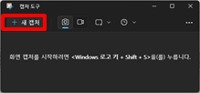
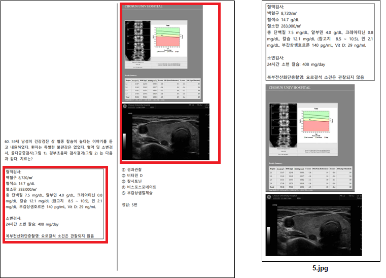

##### mcs.cocomed.net 관리자용 사용 설명서
- 최종 업데이트 날짜 : 2023년 7월 24일
##### 0. 목차
1. 문제지 목록 추가하기
2. 문제지 목록 편집하기
3. 시험문제 편집하기

##### 1. 문제지 목록 추가하기

##### 1-1. 목록에서 "목록 추가" 버튼 클릭하기
- 우측 상단의 "목록 추가" 버튼을 클릭합니다.
- 클릭 시 문제지 목록 추가 페이지로 이동됩니다.
- 

##### 1-2. 문제지 목록 추가 페이지 내 항목 입력하기
- 문제지 목록 추가 페이지입니다.
- 년도, 회차, 교시 및 시험 추가 설명을 입력하실 수 있습니다.
- 시험 과목명, 시험 실시 날짜 및 시험 문제수를 입력하실 수 있습니다.
- 모든 항목 입력 완료 후 우측 하단의 "문제지 목록 추가" 버튼을 클릭하시면 입력하신 내용으로 문제지가 추가되며 목록 페이지로 이동됩니다.
- 

# 2. 문제지 목록 편집하기 <a name="2nd"></a>

## 2-1. 편집할 문제지 선택하기
- 목록에서 편집할 문제지의 더보기 버튼을 클릭 후 "문제지 목록 편집"을 선택합니다.
- 

## 2-2. 문제지 편집하기
- 문제지 목록 편집 페이지입니다.
- 시험 과목명, 시험 실시 날짜 및 시험 문제수를 입력하실 수 있습니다.
- 수정 완료 후 우측 하단의 "변경사항 저장" 버튼을 클릭하시면 입력하신 내용으로 문제지가 변경되며 목록 페이지로 이동됩니다.
- 

# 3. 시험문제 편집하기 <a name="3rd"></a>

## 3-1. 시험문제를 편집할 문제지 선택하기
- 목록에서 추가/수정할 문제지의 "시험문제 편집" 버튼을 클릭합니다.
- 

## 3-2. 시험문제 편집하기
- 시험문제 편집 페이지입니다.
- 문제 내용, 그림파일, 문제보기, 정답, 상세 교실명을 입력하실 수 있습니다.
- ```문제지가 pdf 파일인 경우 복사 붙여넣기를 이용하시면 되지만, hwp 파일인 경우에는 반드시 pdf 파일로 저장하여 사용해 주셔야 합니다.```
- 좌측 하단의 문제번호에 원하는 문제번호를 입력하신 후 "문제번호 바로가기" 버튼을 클릭하시면 해당 문제로 이동됩니다.
- 이전 또는 다음 버튼을 눌러 다른 문제로 이동할 수 있습니다.
- 
- 변경사항을 저장하지 않고 이전 또는 다음 버튼 클릭 시 경고가 발생합니다.
- 

## 3-3. 그림파일 첨부하기
- 문제에 그림파일이 필요한 경우 첨부하실 수 있습니다.
- 그림 삽입 시 파일 탐색기에 있는 이미지 파일을 드래그하여 "그림파일 첨부하기" 박스에 드랍하시거나, "그림파일 첨부하기" 박스를 클릭하여 이미지 파일을 직접 선택하실 수 있습니다.
- ```단, 삽입할 이미지 파일의 이름을 무조건 문제 번호와 똑같이 설정해 주셔야 합니다!```
-  

## 3-4. 문제지 내 그림 캡처하기
### 3-4-1. 프로그램을 이용하는 방법
- 윈도우키를 누르신 뒤 "캡처 도구"라고 검색하셔서 캡처 도구를 실행시킵니다.
-  
- 새 캡처 버튼을 눌러 캡처 영역을 지정합니다.
-  
- 저장 버튼을 눌러 문제 번호명으로 그림을 저장합니다.
-  
### 3-4-2. 단축키를 이용하는 방법
- Windows 로고 키 + Shift + S를 눌러 캡처 모드를 활성화 시키신 후 캡처 영역을 지정합니다.
- 우측 하단에 나오는 알림을 클릭합니다.
-  
- 저장 버튼을 눌러 문제 번호명으로 그림을 저장합니다.
-  
### 3-4-3. 캡처 예시
1. 1번 캡처 예시 <br/>

2. 2번 캡처 예시 <br/>

3. 3번 캡처 예시 <br/>

4. 4번 캡처 예시 <br/>
```그림이 잘려 있는 경우, 잘린 부분들을 캡처하시고 이미지 편집 프로그램을 이용하여 하나로 합치시면 됩니다.```

