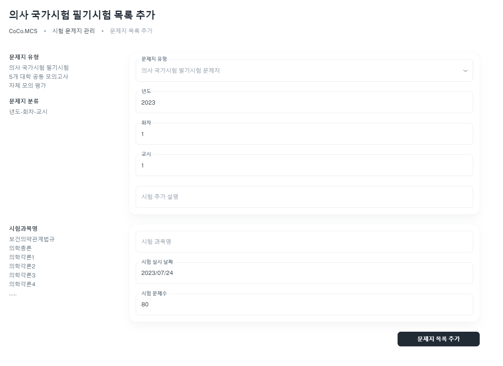

[돌아가기](../main.md)

 
 

# 1. 문제지 목록 추가하기

## 1-1. 목록에서 "목록 추가" 버튼 클릭하기
- 우측 상단의 "목록 추가" 버튼을 클릭합니다.
- 클릭 시 문제지 목록 추가 페이지로 이동됩니다.
- 

## 1-2. 문제지 목록 추가 페이지 내 항목 입력하기
- 문제지 목록 추가 페이지입니다.
- 년도, 회차, 교시 및 시험 추가 설명을 입력하실 수 있습니다.
- 시험 과목명, 시험 실시 날짜 및 시험 문제수를 입력하실 수 있습니다.
- 모든 항목 입력 완료 후 우측 하단의 "문제지 목록 추가" 버튼을 클릭하시면 입력하신 내용으로 문제지가 추가되며 목록 페이지로 이동됩니다.
- 
